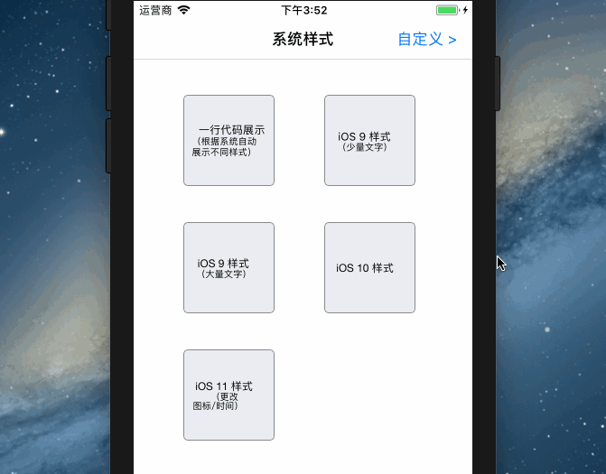
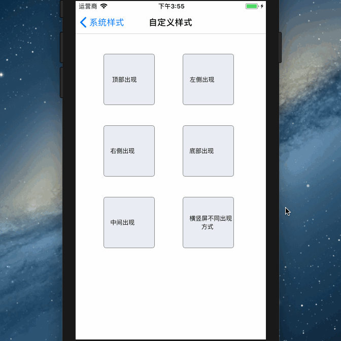

view [English README.md](/README.md)

Email：pikacode@qq.com

QQ群: 345192153


# EBBannerView

只需一行代码即可：

- App 在前台时展示跟 iOS9/10/11 推送通知一样 UI 的横幅，自动根据系统版本显示不同 UI


- 根据手机是否静音自动播放提示音或振动
- iOS 9 样式支持下拉手势

并且可以：

- 自定义横幅的图标、标题、时间、内容、动画时间
- 自定义弹出时的声音，可选用系统提示音，或者自己添加声音文件
- 横竖屏自适应


- 完全自定义弹出的 view，自定义 view 在横竖屏时可以定制不同的 frame
- 自定义 view 在横竖屏时支持分别从不同方向弹出（屏幕上下左右中心）
- 监听点击事件、传值


## 效果

### 系统推送通知样式：

  


### 自定义样式：

  


## 安装

### pod 安装

	target 'YourTargetName' do
	  pod 'EBBannerView'
	end


## 使用


### 系统样式

---

```objc
#import <EBBannerView.h>
```

系统样式有两种使用方式：


#### 方式一：一行代码搞定之省心模式

根据系统不同自动展示 iOS 9/10/11 的样式，并自动展示 app 名称 图标等。

```objc
[EBBannerView showWithContent:@"自定义内容"];
```


#### 方式二：指定不同系统样式，并自定义所有内容

```objc
//1.构造 banner，自定义赋值，没有指定的会使用默认值
EBBannerView *banner = [EBBannerView bannerWithBlock:^(EBBannerViewMaker *make) {
   make.style = EBBannerViewStyleiOS9;//指定系统样式，不指定自动依据系统显示不同样式
   //make.style = 9;//展示 iOS9 样式
   make.content = @"MINE eye hath played the painter and hath stelled";
   //make.object = ...
   //make.icon = ...
   //make.title = ...
   //make.soundID = ...
}];
 
//2.展示
[banner show];
```


##### 参数说明 

（以下参数不赋值时均使用默认值）

- `style`：需要展示的样式，默认值 系统类型，可以直接传 `UIDevice.currentDevice.systemVersion.intValue` 来自动适配不同系统，类型 enum : NSInteger {9/10/11}
- `icon`：图片，默认值 app 的图标，类型 UIImage
- `title`：标题，默认值 app 的名称，类型 NSString
- `date`：时间，默认值 NSLocalizedString(@"现在", nil)，类型 NSString
- `content`：内容，类型 NSString
- `animationDuration`：显示/隐藏动画时间，类型 NSTimeInterval
- `stayDuration`：隐藏之前停留显示的时间，类型 NSTimeInterval
- `object`：监听点击事件 `EBBannerViewDidClickNotification` 后可以获取到，见后文，默认值为 `content`，类型 id
- `soundID`：播放的提示音（静音时会自动振动），类型 UInt32
  - 该参数是 iOS 系统自带的声音 id，默认使用的是`三全音`，id = 1312
  - 其他系统声音 id 可以在这里查询到 [iOS Predefined sounds](http://iphonedevwiki.net/index.php/AudioServices#) 备用地址 [AudioServices sounds](http://www.cocoachina.com/bbs/read.php?tid=134344)
  - 可以在这里 [UISounds.zip](/UISounds.zip) 下载并试听全部系统声音，然后选择自己想用的声音，根据名称对照上面提供的表格查找到相应的 `id`
- `soundName`：播放自定义的声音文件，类型 NSString
  - 直接将声音文件拖拽到工程目录
  - 赋值时包含拓展名，例 sound.mp3


### 自定义样式

---

```objc
#import <EBCustomBannerView.h>
```

自定义样式有两种使用方式：


#### 方式一：构造并立刻展示：

```objc
UIView *view = ...;//需要展示的某个 view

[EBCustomBannerView showCustomView:view block:^(EBCustomBannerViewMaker *make) {
   make.portraitFrame = ...;//竖屏时的 frame
   make.portraitMode = EBCustomViewAppearModeTop;//竖屏时弹出方向
   make.soundID = 1312;//声音
   make.stayDuration = 3.0;//停留时间
   //......
}];
```


#### 方式二：构造并稍后展示：

```objc
UIView *view = ...;//需要展示的某个 view

//1.传入 view，并构造必要的参数
EBCustomBannerView *customView = [EBCustomBannerView customView:view block:^(EBCustomBannerViewMaker *make) {
   make.portraitFrame = ...;//竖屏时的 frame
   make.portraitMode = EBCustomViewAppearModeTop;//竖屏时弹出方向
   make.soundID = 1312;//声音
   make.stayDuration = 3.0;//停留时间
   //......
}];

//2.展示
[customView show];
//[customView hide];
```


##### 参数说明：

- `portraitFrame`：竖屏时的 frame，默认值 view.frame，类型 CGRect
- `landscapeFrame`：横屏时的 frame，默认值 view.frame，类型 CGRect
- `soundID`：参见系统样式中参数说明
- `soundName`：参见系统样式中参数说明
- `animationDuration`：参见系统样式中参数说明
- `stayDuration`：参见系统样式中参数说明
- `portraitMode`：竖屏时 view 出现的方向，上/下/左/右/中，默认值 Top，类型 enum
- `landscapeMode`：横屏时 view 出现的方向，上/下/左/右/中，默认值 Top，类型 enum
- `centerModeDurations`：view 从中心出现的动画时间，默认值 @[@0.3, @0.2, @0.1]，中心出现的动画 `animationDuration` 参数无效


## 监听、处理点击事件、传值（系统样式）

- 通过监听 `EBBannerViewDidClickNotification` 通知，处理点击事件
  - 如果初始化 banner 的时候传了 object 的值，在点击后可以获取到
  - 如果初始化没传，默认是 `content` 的值

```objc
#import <EBBannerView.h>
{
   ...
   EBBannerView *banner = [EBBannerView bannerWithBlock:^(EBBannerViewMaker *make) {
      ...
      make.object = aObject;
   }];
}

{
   ...
   [[NSNotificationCenter defaultCenter] addObserver:self selector:@selector(bannerViewDidClick:) name:EBBannerViewDidClickNotification object:nil];
}

-(void)bannerViewDidClick:(NSNotification*)noti{
   NSLog(@"%@",noti.object);
}
```
